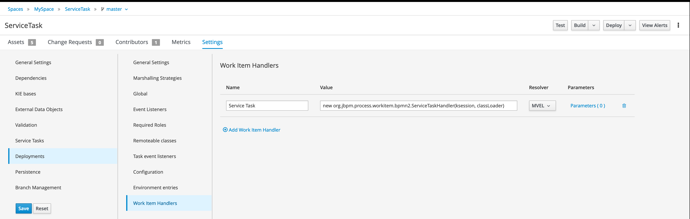
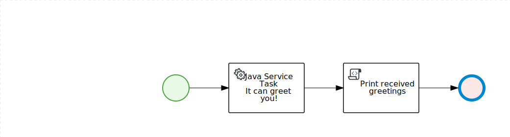
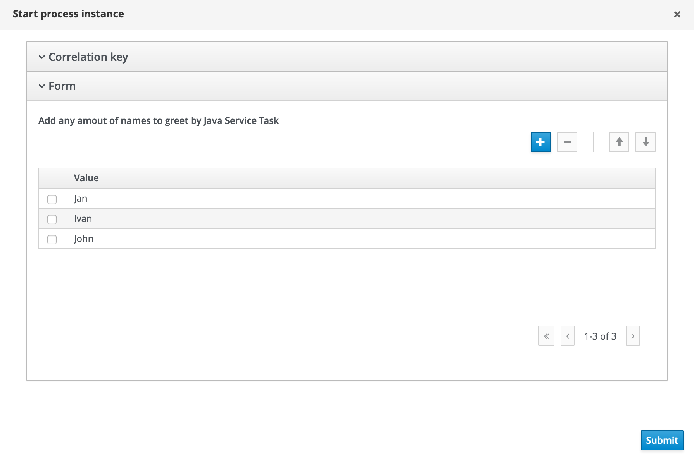
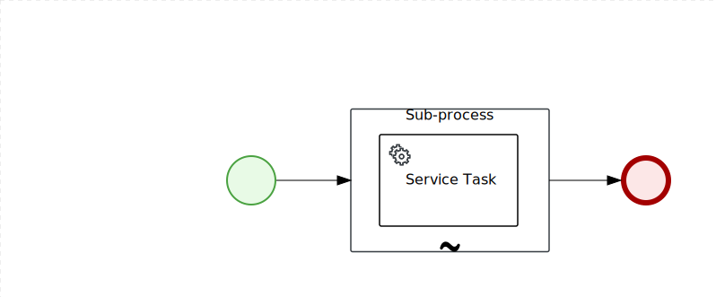
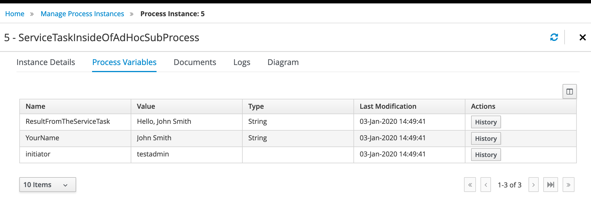
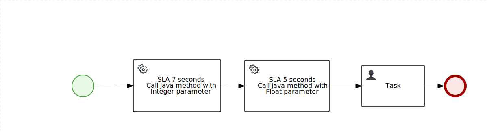
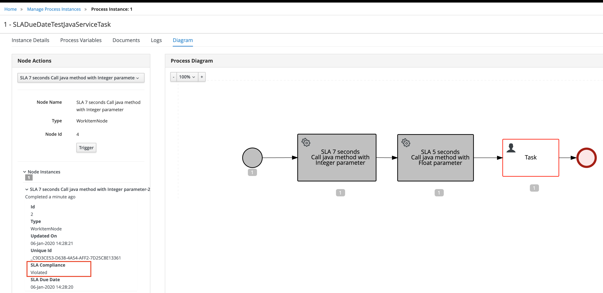

Repository to test Java Service Task in KIE Business Central
============================================================

> ### Important Note
> This repository uses *.jar artifact with Java Class from https://github.com/bpmn-tutorials/ServiceTaskTest

> ### Important Note 2
> Don't forget to install Work Item Handler of Service Task to your new project (it is already configured for this one)
>  

Repository contains  3 Business Processes to test:
* **JavaTask** Business Process - uses Java Service Task to greet multiple users inside of _Java Service Task_ using *Multiple Instance* property.
* **ServiceTaskInsideOfAdHocSubProcess** - uses Java Service Task for simple greetings one user at a time inside of AdHocSubprocess.
* **SLADueDateTestJavaServiceTask** - demonstrates how to use SLA for Java Service Tasks. Also demonstrate how to use Java Services Tasks Parameters with different data types than String.

## JavaTask



When you start this process you will be asked for list of names. Each of this names (up to 3, see parameters below) will be sent to Java Service Task and string "Hello, %name%" will be returned back to the process and all resulted strings will be printed in the Script task.


  
### Used Parameters of _Java Service Task_
* **Implementation** - *Java* (Java class will be executed)
* **Interface** - *org.test.service.SimpleServiceTask* (FQN of the executed class)
* **Operation** - *sayHelloTo* (method name to invoke)
* **Multiple Instance** - *true* (Task will be executed as many times as many names will be provided in Process Variable _InputCollection_)
* **MI Collection input** - *InputCollection* (Array list provided during process start)
* **MI Data Input** - *Parameter* this is Input Data Assignment for Java Service task, it will be transferred to java class
* **MI Collection output** - *OutputCollection* (Array list where values returned from Java Task will be stored)
* **MI Data Output** - *Result* this is Output Data Assignment for Java Service Task, when class executed on the server this variable will store the result
* **MI Completion Condition (mvel)** - `OutputCollection.size() == 3` no more than three people will be greeted.

After execution following text will be printed in Server Log (*On Entry Action* and *On Exit Action* Properties of Java Service Task used to format Task Invocation data. At the end of the output you can see that all provided names are greeted by Service Task and result printed to the server log.)
```console
12:43:26,938 INFO  [stdout] (default task-18) ================================
12:43:26,938 INFO  [stdout] (default task-18) Java Service Task instance is about to be executed.
12:43:26,938 INFO  [stdout] (default task-18) Thread ID is: 2600
12:43:26,938 INFO  [stdout] (default task-18) Provided name = Jan
12:43:26,938 INFO  [stdout] (default task-18)
12:43:26,939 INFO  [stdout] (default task-18) Hello world from the Java Service Task.
12:43:26,940 INFO  [stdout] (default task-18)
12:43:26,940 INFO  [stdout] (default task-18) Java Service Task instance is about to finish it's work.
12:43:26,940 INFO  [stdout] (default task-18) Result returned by Java service is: Hello, Jan
12:43:26,940 INFO  [stdout] (default task-18) ================================
12:43:26,940 INFO  [stdout] (default task-18)
12:43:26,943 INFO  [stdout] (default task-18) ================================
12:43:26,943 INFO  [stdout] (default task-18) Java Service Task instance is about to be executed.
12:43:26,943 INFO  [stdout] (default task-18) Thread ID is: 2600
12:43:26,943 INFO  [stdout] (default task-18) Provided name = Ivan
12:43:26,943 INFO  [stdout] (default task-18)
12:43:26,944 INFO  [stdout] (default task-18) Hello world from the Java Service Task.
12:43:26,945 INFO  [stdout] (default task-18)
12:43:26,945 INFO  [stdout] (default task-18) Java Service Task instance is about to finish it's work.
12:43:26,945 INFO  [stdout] (default task-18) Result returned by Java service is: Hello, Ivan
12:43:26,945 INFO  [stdout] (default task-18) ================================
12:43:26,945 INFO  [stdout] (default task-18)
12:43:26,947 INFO  [stdout] (default task-18) ================================
12:43:26,947 INFO  [stdout] (default task-18) Java Service Task instance is about to be executed.
12:43:26,947 INFO  [stdout] (default task-18) Thread ID is: 2600
12:43:26,947 INFO  [stdout] (default task-18) Provided name = John
12:43:26,947 INFO  [stdout] (default task-18)
12:43:26,947 INFO  [stdout] (default task-18) Hello world from the Java Service Task.
12:43:26,948 INFO  [stdout] (default task-18)
12:43:26,948 INFO  [stdout] (default task-18) Java Service Task instance is about to finish it's work.
12:43:26,948 INFO  [stdout] (default task-18) Result returned by Java service is: Hello, John
12:43:26,948 INFO  [stdout] (default task-18) ================================
12:43:26,948 INFO  [stdout] (default task-18)
12:43:26,950 INFO  [stdout] (default task-18) Hello, Jan
12:43:26,950 INFO  [stdout] (default task-18) Hello, Ivan
12:43:26,950 INFO  [stdout] (default task-18) Hello, John
12:43:26,950 INFO  [stdout] (default task-18) Thread ID is: 2600
```

## ServiceTaskInsideOfAdHocSubProcess


### Used Parameters of _Java Service Task_
* **Implementation** - *Java* (Java class will be executed)
* **Interface** - *org.test.service.SimpleServiceTask* (FQN of the executed class)
* **Operation** - *sayHelloTo* (method name to invoke)
* **AdHoc Autostart** - *true* (Task will be executed automatically when parent AdHoc Sub-process will be triggered)
* **Input Data Assignment** - *Parameter* this is Input Data Assignment for Java Service task, it will be transferred to java class. Mapped to process variable.
* **Output Data Assignment** - *Result* this is Output Data Assignment for Java Service Task, when class executed this variable will store the result and transfer to Process variable.

When you start process your name will be asked. When process will be finished you will see that Process variable *ResultFromTheServiceTask* will store `Hello, %name%` answer.


## SLADueDateTestJavaServiceTask


This process cointains two Java Service Task wich calls the same overriden methods:
```java
    public void waitInterval(Integer seconds) {
        [...]
        wait(Math.max(seconds, 3));
        [...]
    }

    public void waitInterval(Float minutes) {
        int seconds = (int)(minutes * 60);
        waitInterval(seconds);
    }
```

First Java Service Task (_SLA 7 seconds Call java method with Integer parameter_) takes Integer parameter and has 7 seconds SLA, if you send value more than 7 seconds, SLA will be violated, if less than 7 seconds, SLA will pass.

Second Java Service Task (_SLA 5 seconds Call java method with Float parameter_) takes Float parameter and converts it to seconds `(minutes * 60)` and has 5 seconds SLA or (0.08333) in float value. If you will send value more or equal to 0.084, SLA will be violated, if less or equal to 0.083 SLA will pass.

### Used Parameters of _Java Service Task_ - _SLA 7 seconds Call java method with Integer parameter_
* **Implementation** - *Java* (Java class will be executed)
* **Interface** - *org.test.service.SimpleServiceTask* (FQN of the executed class)
* **Operation** - *waitInterval* (method name to invoke)
* **Input Data Assignment** - has two variables:
  * *Parameter* this is Input Data Assignment for Java Service task, it will be transferred to java class. Mapped to process variable.
  * *ParameterType* this is Input Data Assignment for Java Service task, it will be transferred to java class and represent type of the *Parameter*. Mapped to constant *java.lang.Integer*.
* **SLA Due Date** - *7s* if you will send to the task parameter with Parameter value more than 7 seconds, SLA Due Date will be violated.

### Used Parameters of _Java Service Task_ - _SLA 5 seconds Call java method with Float parameter_
* **Implementation** - *Java* (Java class will be executed)
* **Interface** - *org.test.service.SimpleServiceTask* (FQN of the executed class)
* **Operation** - *waitInterval* (method name to invoke)
* **Input Data Assignment** - has two variables:
  * *Parameter* this is Input Data Assignment for Java Service task, it will be transferred to java class. Mapped to process variable.
  * *ParameterType* this is Input Data Assignment for Java Service task, it will be transferred to java class and represent type of the *Parameter*. Mapped to constant *java.lang.Float*.
* **SLA Due Date** - *5s* if you will send to the task parameter with Parameter value more than 0.083 minutes, SLA Due Date will be violated.

When process is executing you can see SLA status of the tasks in the Process Instance Diagram, just click on the task and check the information about it.
